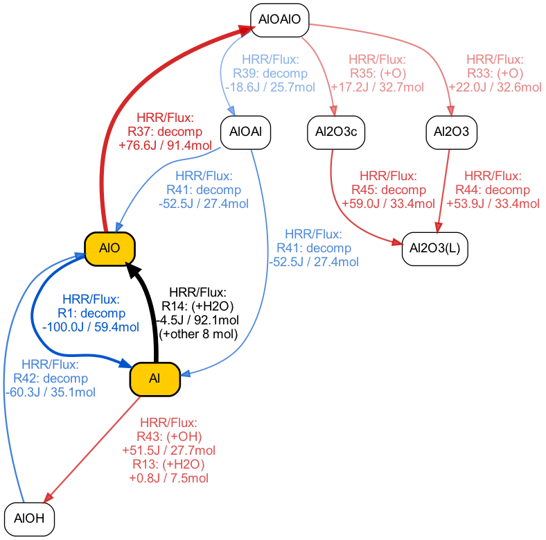

# Reaction Pathway Analysis

A Python library for chemical reaction pathway analysis and visualization. It traces element transfer between species through a reaction mechanism, computes flux-weighted pathway diagrams, and renders them as directed graphs.

The tool will integrate the reaction rates with the stiff solver shipped by Cantera, with thermochemical information provided by the user. The integration automatically utilizes all CPU cores.

The library is modified from Margherita's OpenFOAM repository.

## Citation
BibTeX:
```code
@inproceedings{Miccio2025reactionpath,
  author    = {Margherita Miccio},
  title     = {Reaction Path Analysis from {OpenFOAM} using {Graphviz}},
  booktitle = {Proceedings of CFD with OpenSource Software},
  editor    = {Håkan Nilsson},
  year      = {2025},
  doi       = {10.17196/OS_CFD#YEAR_2025},
  url       = {https://www.tfd.chalmers.se/~hani/kurser/OS_CFD/},
  publisher = {Chalmers University of Technology},
}
```

Plain text:
M. Miccio, "Reaction Path Analysis from OpenFOAM using Graphviz," in Proceedings of CFD with OpenSource Software, edited by H. Nilsson, Chalmers University of Technology, 2025. https://dx.doi.org/10.17196/OS_CFD#YEAR_2025


## Features

- **Stiff ODE integration** — Integrates gas-phase kinetics at each spatial point using Cantera's stiff solver.
- **Element-transfer tracing** — Tracks how a specified element (e.g., Al) flows between species across reactions.
- **Pathway flux computation** — Aggregates reaction fluxes over a filtered spatial region from CFD sampling-line data.
- **Graph visualization** — Generates Graphviz-based directed pathway diagrams with configurable thresholds for edge filtering, entry filtering, and neighbor filtering.
- **CSV I/O** — Reads and writes pathway data in a simple CSV format for reproducibility and post-processing.

## Dependencies

- Python 3
- [Cantera](https://cantera.org/)
- NumPy
- Pandas
- Matplotlib
- [Graphviz](https://graphviz.org/) (Python package `graphviz`)
- tqdm

## Usage

You need to provide a Pandas DataFrame containing all species mass fractions (Y), temperature (T), and pressure (p), along with a Cantera-compatible mechanism file (e.g., `.yaml`).

See [`main.ipynb`](main.ipynb) for a complete tutorial and worked example.

## Example Output



